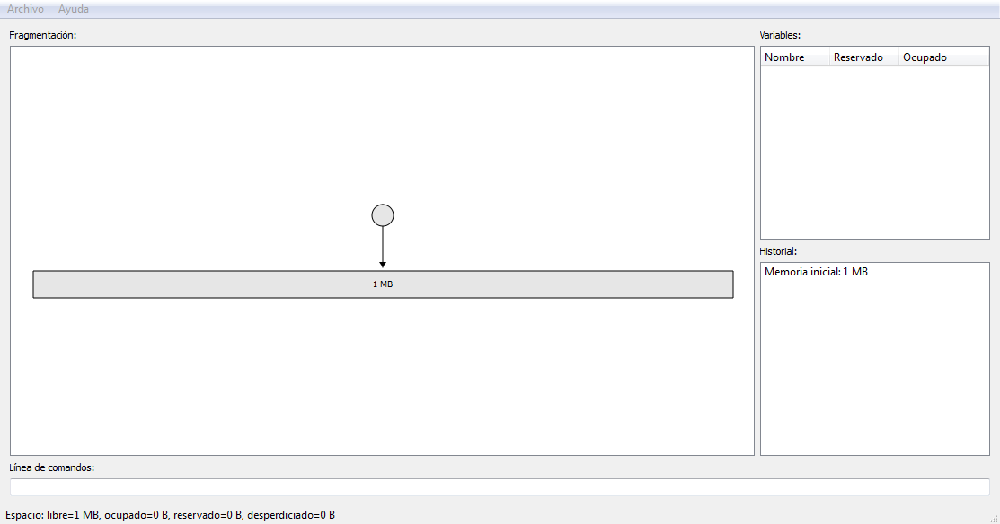
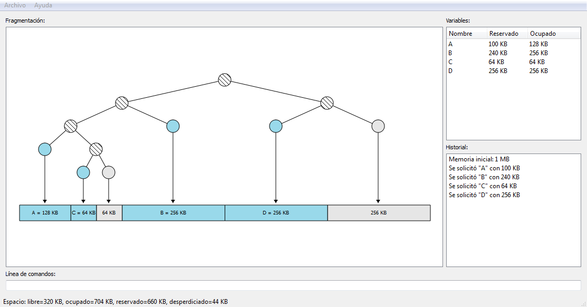
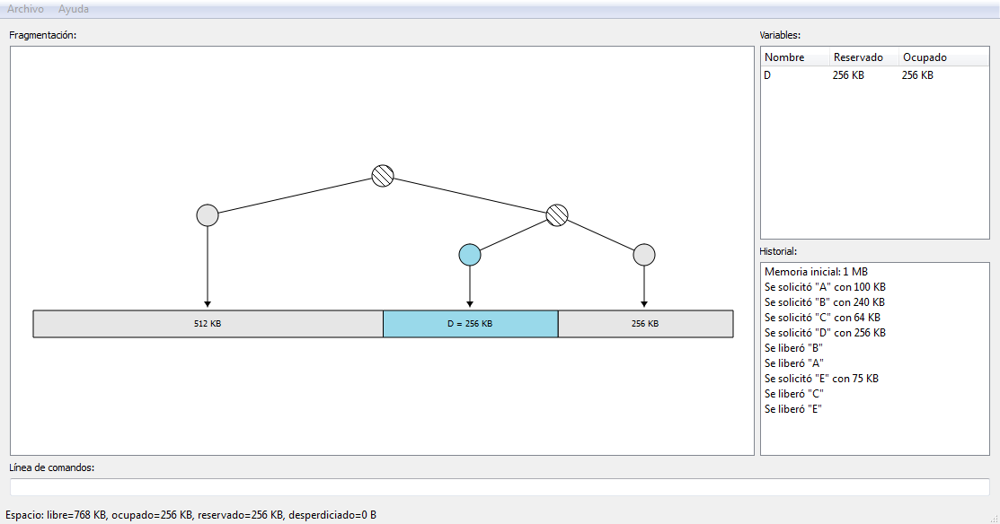
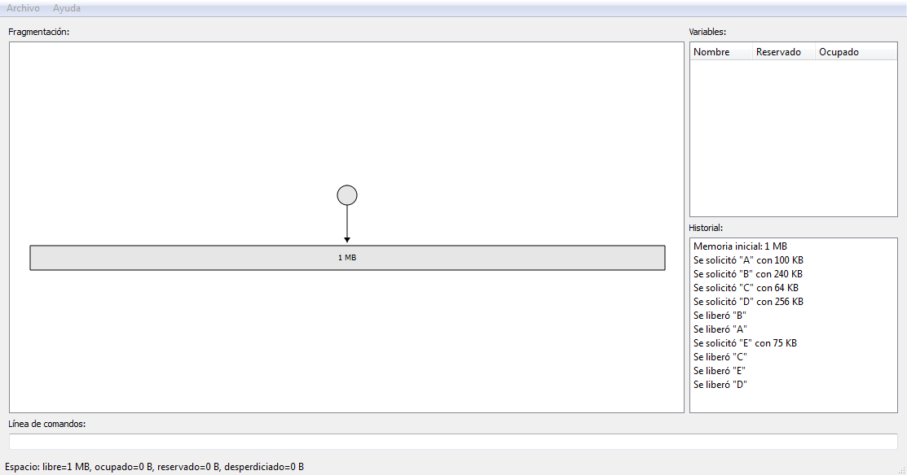

# BuddySystem v2

<http://www.germix.hol.es/2017/01/07/buddy-system/>

El sistema buddy es un algoritmo para la gestión de memoria, a continuación un pequeño extracto del libro “Sistemas Operativos” de William Stallings:

El sistema buddy es un compromiso razonable para eliminar las desventajas de los esquemas de particionamiento tanto fijo, como variable, pero en los sistemas operativos contemporáneos, la memoria virtual basada en paginación y segmentación es superior.

La desventajas de un esquema de particionamiento fijo es que limita el número de procesos activos y puede utilizar el espacio ineficiente si existe un mal ajuste entre los tamaños de partición disponibles y los tamaños de los procesos; un esquema de particionamiento dinámico es más complejo de mantener e incluye la sobrecarga de la compactación.

En un sistema buddy, los bloques de memoria disponibles son de tamaño 2^k, L <= K <= U, donde:
2^L = bloque de tamaño más pequeño asignado
2^U = bloque de tamaño mayor asignado; normalmente 2^U es el tamaño de la memoria completa disponible.

Para comenzar, el espacio completo disponible se trata como un único bloque de tamaño 2^U. Si se realiza una petición de tamaño s, tal que 2^U-1 < s <= 2^U, se asigna el bloque entero. En otro caso, el bloque se divide en dos bloques buddy iguales de tamaño 2^U-1, entonces se asigna la petición a uno de los otros dos bloques. En otro caso, uno de ellos se divide por la mitad de nuevo. Este proceso continua hasta que el bloque más pequeño mayor o igual que s se genera y se asigna a la peticion.

A continuación el ejemplo provisto por el libro “Sistemas Operativos” de William Stallings:

```
reset 1M
```


```
A = alloc 100K
B = alloc 240K
C = alloc 64K
D = alloc 256K
```



```
free B
free A
E = alloc 75K
free C
free E
```


```
free D
```

