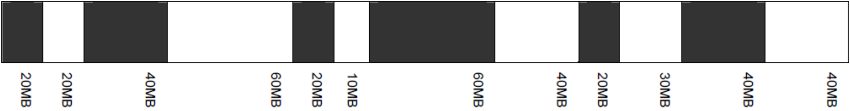
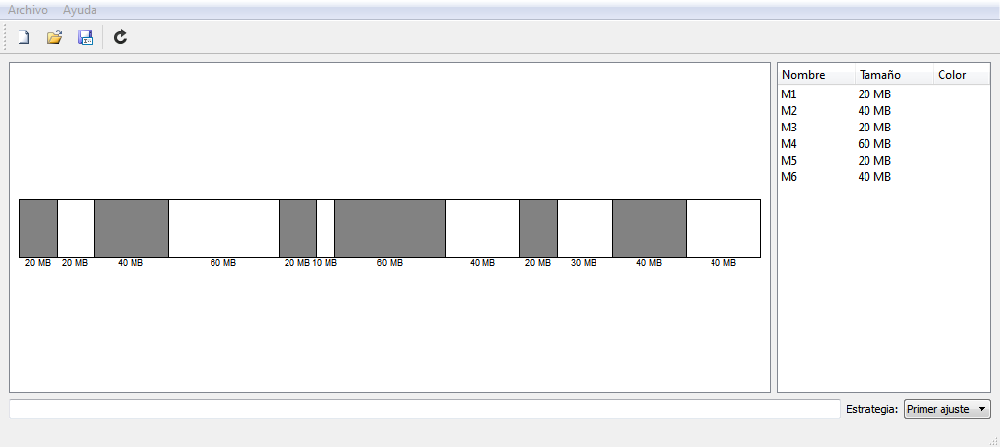
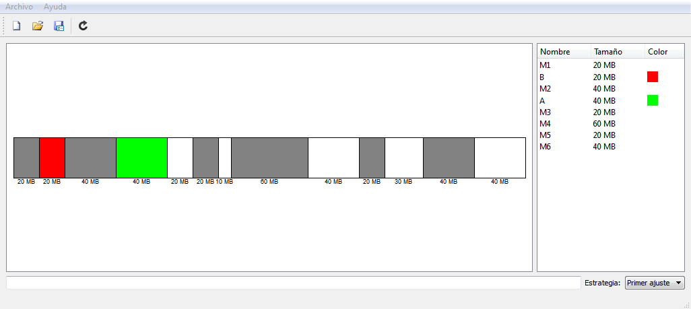
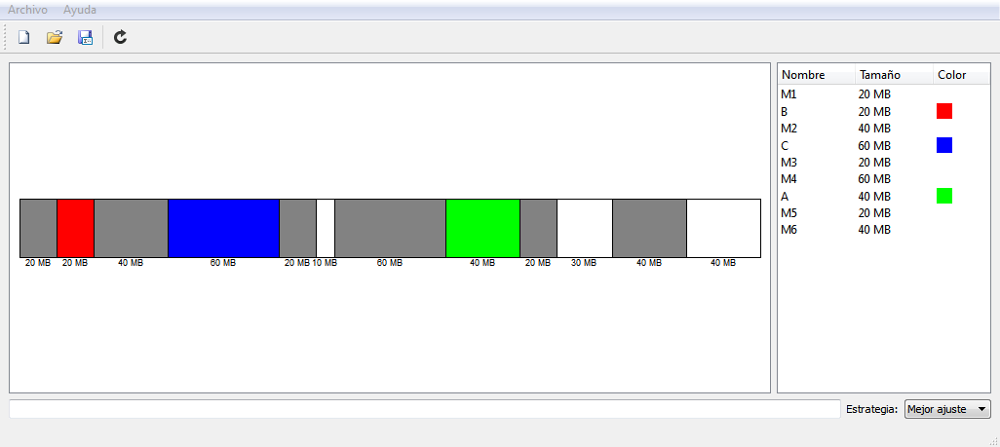
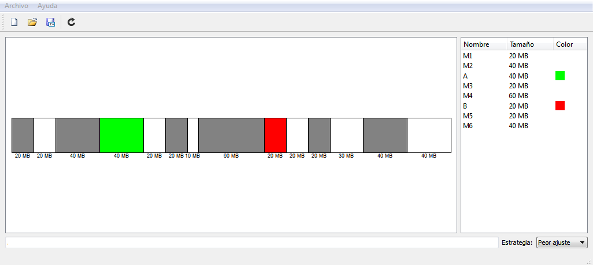

# DynamicPartitioning

<http://www.germix.hol.es/2017/01/31/dynamic-partitioning/>

En este artículo se presenta un programa para simular la administración de memoria con particionado dinámico.

A continuación un ejemplo:

Un sistema usa un esquema de particionado dinámico, y la configuración actual de la memoria es como se muestra a continuación:



Las áreas sombreadas corresponden a bloques asignados, mientras que las áreas en blanco son bloques libres. Los próximos tres requerimientos a memoria son de 40 MB, 20MB y 60 MB. Indicar las direcciones de inicio de cada uno de los tres bloques usados para cada algoritmo de ubicación especificado:

```
a) Primer ajuste
b) Mejor ajuste
c) Peor ajuste
```

Cargamos el archivo mem-ejer4.xml



Para llevar a cabo este ejemplo, se ejecuta los tres siguientes comandos, para cada uno de las estrategias de ajustes:

```
alloc 40M, name=A, color=green
alloc 20M, name=B, color=red
alloc 60M, name=C, color=blue
```

Y para cada una de las estrategias tenemos los siguientes resultados:

Primer ajuste  


Mejor ajuste  


Peor ajuste  

