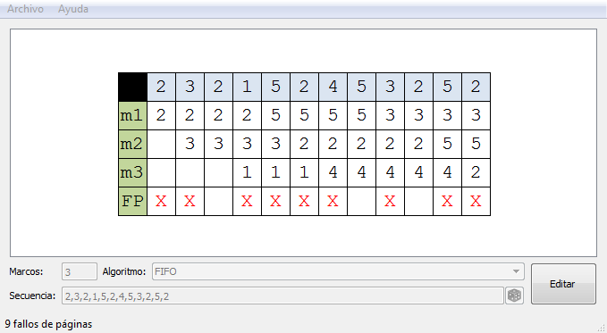
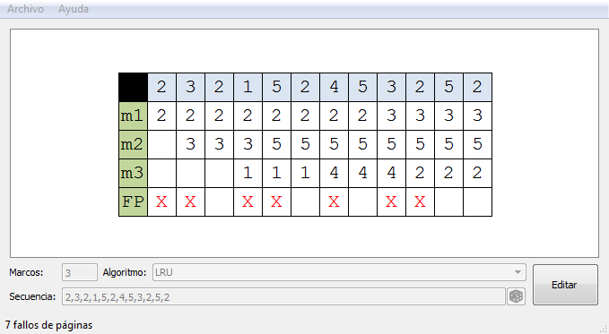
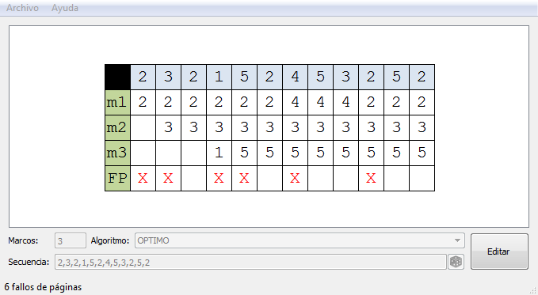
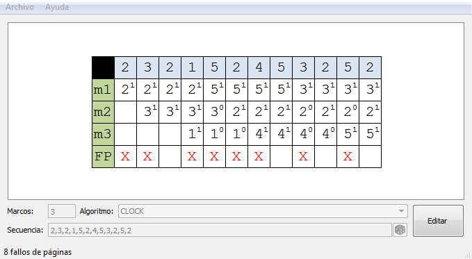
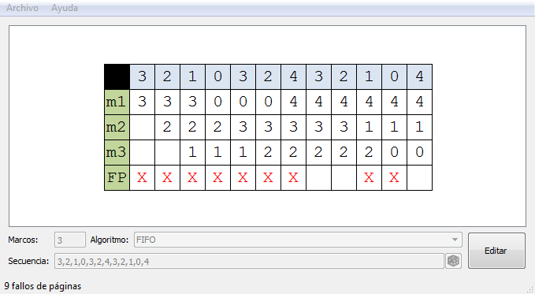
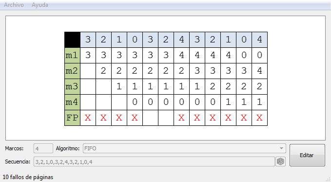

# PageReplacement

<http://www.germix.hol.es/2017/01/14/page-replacement/>

En este artículo se presenta un programa para simular algoritmos de reemplazo de páginas.

A continuación ejemplos de muestra, tomando los ejemplos tomados de “Sistemas Operativos” de William Stallings:

FIFO:  

LRU:  

OPTIMO:  

RELOJ:  

Ejemplo de la Anomalía de Belady:  
  
  
