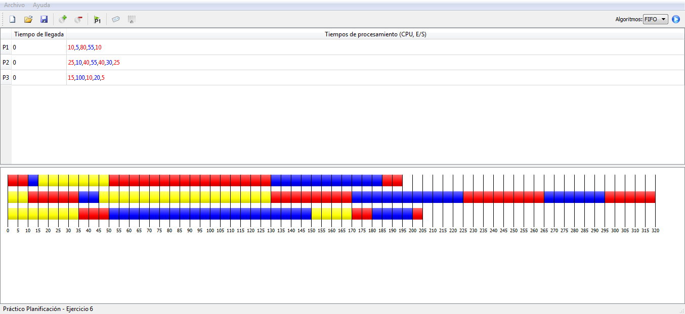
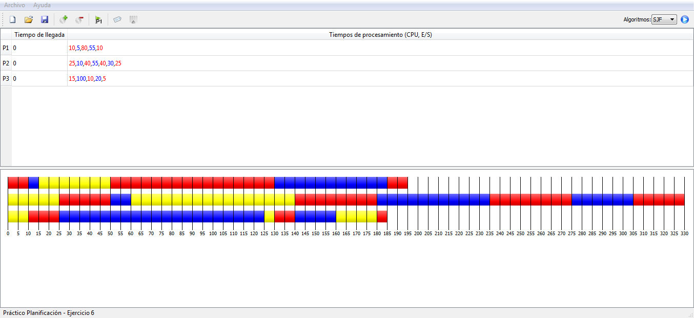
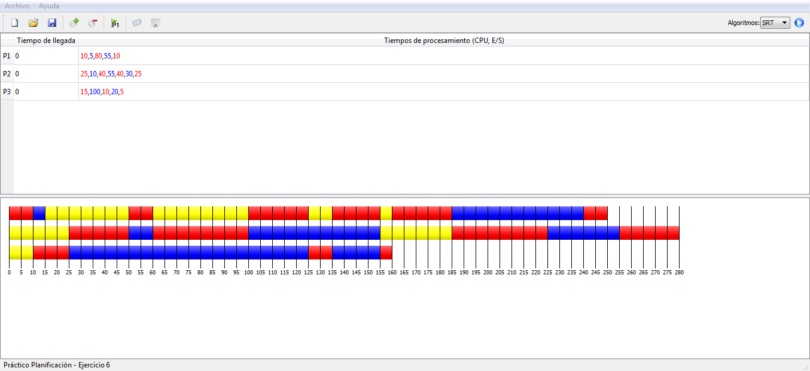
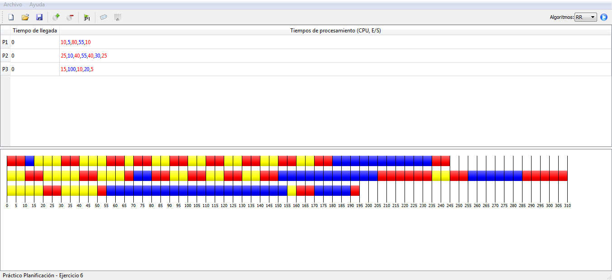

# Scheduling

<http://www.germix.hol.es/2017/01/18/scheduling/>

En este artículo se presenta un programa para simular algoritmos de planificación de procesos.

A continuación ejemplos de muestra, tomando los ejemplos del ejercicio 6 propuesto en la cátedra “Sistemas Operativos” de las carreras “Analista Programador”, “Ingeniería en Sistemas” de la Facultad de Ingeniería UNLPam:

Dados tres procesos A, B y C a ser ejecutados, con las siguientes trazas:

```
Proceso A = {10, 5, 80, 55, 10}
Proceso B = {25, 10, 40, 55, 40, 30, 25}
Proceso C = {15, 100, 10, 20, 5}
```

Los procesos arriban al sistema en el tiempo 0.

Algoritmo FIFO  
  

Algoritmo SJF  
  

Algoritmo SRT  
  

Algoritmo Round-Robin. Quantum=10  
  
