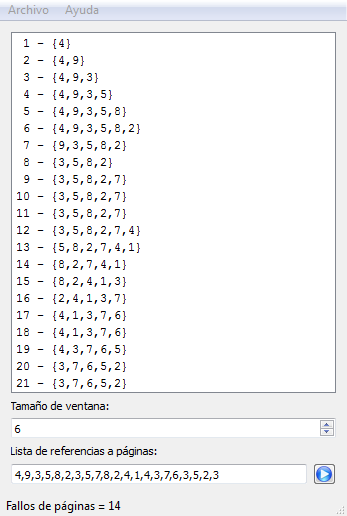
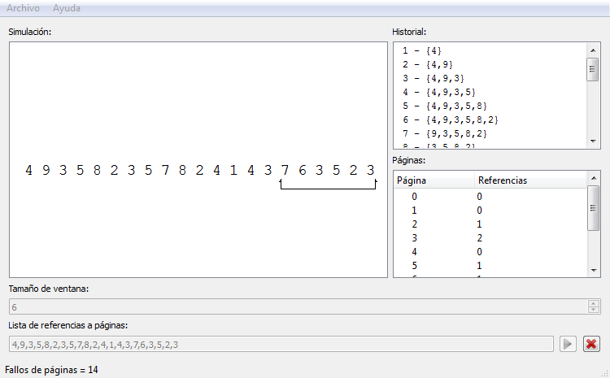

# WorkingSet v2

<http://www.germix.hol.es/2017/02/03/working-set/>

¿Que es working-set?

El working-set de un programa es una colección de segmentos (o páginas) recientemente referenciadas. La idea es que cada proceso mantenga un mínimo de paginas que han sido referenciadas; con esto se pretende reducir la cantidad de fallos de páginas.

Para más información:

<https://users.dcc.uchile.cl/~jpiquer/Docencia/SO/aps/node30.html>  
<http://docs.lib.purdue.edu/cgi/viewcontent.cgi?article=1207&context=cstech>  

A continuación un ejemplo: un tamaño de ventana de 6 y la secuencia de referencia es:

```
4,9,3,5,8,2,3,5,7,8,2,4,1,4,3,7,6,3,5,2,3.
```

Versión 1  
  

Versión 2  
  
